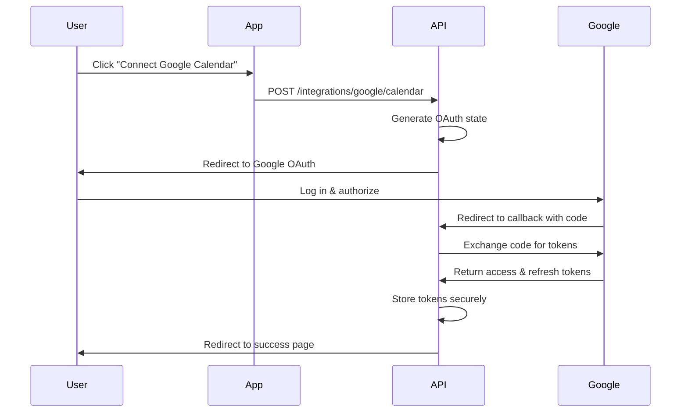

Integrate external calendar services like Google Calendar to automatically sync availability and prevent double-bookings.

## Google Calendar Integration

Connect your Google Calendar to automatically block time when you have external appointments.

### Initiate Google Calendar OAuth

<Note>
Requires authentication.
</Note>

Start the Google Calendar authorization flow.

```bash POST /api/v1/merchant/integrations/google/calendar
curl -X POST 'https://api.example.com/api/v1/merchant/integrations/google/calendar' \
  --cookie "session_token=your_session_token"
```

This endpoint:
1. Generates a Google OAuth authorization URL
2. Sets a secure state cookie for CSRF protection
3. Redirects the user to Google's authorization page

### Response

The endpoint returns an HTTP redirect (307 Temporary Redirect) to Google's OAuth consent screen where the user will:
1. Log in to their Google account (if not already logged in)
2. Review the permissions requested
3. Authorize the application
4. Be redirected back to the callback URL

### OAuth Flow



## Handle OAuth Callback

<Note>
This endpoint is called by Google after authorization. Do not call directly.
</Note>

Google redirects to this endpoint after the user authorizes the application.

```bash PUT /api/v1/merchant/integrations/google/calendar/callback
# This is called automatically by Google with query parameters:
# ?code=AUTHORIZATION_CODE&state=STATE_TOKEN
```

The endpoint:
1. Validates the OAuth state to prevent CSRF attacks
2. Exchanges the authorization code for access and refresh tokens
3. Stores the tokens securely in the database
4. Sets up calendar sync
5. Redirects to the integrations page in the app

<ParamField query="code" type="string" required>
  OAuth authorization code from Google
</ParamField>

<ParamField query="state" type="string" required>
  OAuth state token for CSRF protection
</ParamField>

### Error Handling

If the state validation fails:

```json
{
  "error": {
    "message": "error during oauth state validation: [details]"
  }
}
```

Possible errors:
- Invalid or expired state token
- Mismatched state (potential CSRF attack)
- Failed token exchange with Google
- Database storage failure

## Calendar Change Notifications

<Warning>
This endpoint is called by Google's push notification system. Do not call directly.
</Warning>

Google sends notifications to this endpoint when calendar events change.

```bash POST /api/v1/merchant/integrations/google/calendar/watch
# Called by Google with headers:
# X-Goog-Channel-ID: unique-channel-identifier
# X-Goog-Resource-ID: resource-identifier  
# X-Goog-Resource-State: sync|exists|not_exists|update
```

The endpoint:
1. Receives notifications from Google about calendar changes
2. Triggers a sync to update blocked times
3. Always returns 200 OK (required by Google's protocol)
4. Logs errors internally without failing the request

<ParamField header="X-Goog-Channel-ID" type="string" required>
  Unique identifier for the notification channel
</ParamField>

<ParamField header="X-Goog-Resource-ID" type="string" required>
  Google's resource identifier
</ParamField>

<ParamField header="X-Goog-Resource-State" type="string" required>
  Type of change: "sync" (initial), "exists", "not_exists", or "update"
</ParamField>

### Notification States

- **sync**: Initial handshake notification (ignored)
- **exists**: Resource exists (triggers sync)
- **not_exists**: Resource deleted (triggers sync)
- **update**: Resource updated (triggers sync)

## How Calendar Sync Works

### Initial Setup

1. User connects Google Calendar via OAuth
2. System retrieves user's calendar events
3. Creates blocked times for existing events
4. Sets up a notification channel for real-time updates

### Ongoing Sync

1. User creates/updates/deletes event in Google Calendar
2. Google sends notification to the watch endpoint
3. System fetches updated calendar data
4. Creates, updates, or deletes corresponding blocked times
5. Merchant calendar reflects the changes immediately

### Blocked Time Creation

For each Google Calendar event:

```javascript
// Simplified sync logic
const googleEvent = {
  summary: "Doctor Appointment",
  start: "2026-03-03T14:00:00Z",
  end: "2026-03-03T15:00:00Z"
};

// Creates blocked time
const blockedTime = {
  name: googleEvent.summary,
  from_date: googleEvent.start,
  to_date: googleEvent.end,
  all_day: false,
  source: "google_calendar"
};
```

### All-Day Events

All-day events in Google Calendar:

```javascript
const allDayEvent = {
  summary: "Vacation",
  start: { date: "2026-04-01" },
  end: { date: "2026-04-08" }
};

// Creates all-day blocked time
const blockedTime = {
  name: "Vacation",
  from_date: "2026-04-01T00:00:00Z",
  to_date: "2026-04-07T23:59:59Z",
  all_day: true,
  source: "google_calendar"
};
```

## Managing Connected Calendars

While the API provides connection endpoints, calendar management typically includes:

### Viewing Connected Calendars

Check which external calendars are connected:
- Google Calendar connection status
- Last sync time
- Sync errors (if any)

### Disconnecting Calendars

To disconnect a calendar integration:
1. Revoke the OAuth tokens
2. Stop the notification channel
3. Optionally delete synced blocked times

(Note: Disconnect endpoint may be added in future versions)

## Best Practices

### Calendar Selection

After connecting Google Calendar:
1. Choose which calendars to sync (work, personal, etc.)
2. Only sync calendars with relevant availability
3. Exclude calendars with tentative or optional events

### Sync Preferences

1. **Event Types**: Sync "busy" events but not "free" or "tentative"
2. **Privacy**: Sync time blocks without exposing event details to customers
3. **Two-Way Sync**: Consider if bookings should also appear in Google Calendar

### Security

1. **Token Storage**: OAuth tokens are stored securely encrypted
2. **State Validation**: CSRF protection via state parameter
3. **Scope Limitation**: Request only necessary calendar scopes
4. **Revocation**: Users can revoke access anytime via Google Account settings

### Error Recovery

1. **Token Expiration**: System automatically refreshes expired tokens
2. **Sync Failures**: Logs errors and retries failed syncs
3. **Manual Re-sync**: Users can trigger manual sync if needed

## Permissions Required

The Google Calendar integration requires:

- `https://www.googleapis.com/auth/calendar.readonly` - Read calendar events
- `https://www.googleapis.com/auth/calendar.events.readonly` - Read event details

These minimal scopes ensure:
- No modification of Google Calendar events
- Read-only access to prevent accidental changes
- User maintains full control of their calendar

## Future Integrations

Planned integrations may include:

- **Microsoft Outlook Calendar**
- **Apple Calendar**
- **Office 365**
- **iCloud Calendar**

The architecture is designed to support multiple calendar providers with similar OAuth flows.
