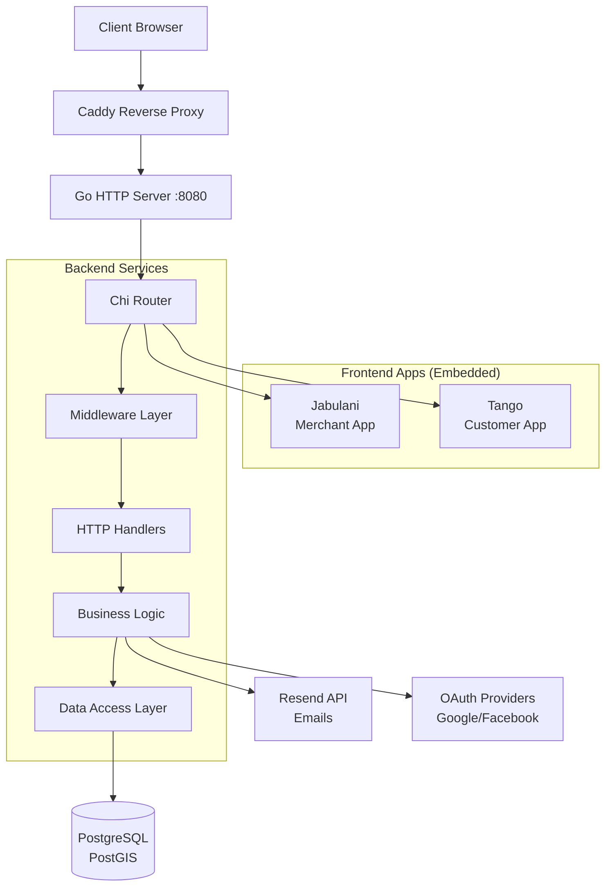

## System Overview

Reservations is built as a **monolithic application** that compiles into a single binary. The architecture combines a Go backend with two embedded React frontends, all served through a unified HTTP server.



## Tech Stack

### Backend Technologies

<CardGroup cols={2}>
  <Card title="Go 1.21+" icon="golang">
    **HTTP Server & Business Logic**
    
    - Chi router for HTTP routing
    - Standard library HTTP server
    - Context-based request handling
    - Clean architecture patterns
  </Card>
  
  <Card title="PostgreSQL + PostGIS" icon="database">
    **Data Persistence**
    
    - PostgreSQL 14+ for relational data
    - PostGIS extension for geospatial features
    - pgx/v5 driver for performance
    - Connection pooling with pgxpool
  </Card>
  
  <Card title="JWT Authentication" icon="key">
    **Security & Auth**
    
    - Access tokens (15 min expiry)
    - Refresh tokens (7 day expiry)
    - Token versioning for revocation
    - OAuth2 integration
  </Card>
  
  <Card title="Resend" icon="envelope">
    **Email Delivery**
    
    - Transactional emails
    - Scheduled email reminders
    - HTML templates with i18n
    - Email cancellation support
  </Card>
</CardGroup>

### Frontend Technologies

<CardGroup cols={2}>
  <Card title="React 19" icon="react">
    **UI Framework**
    
    - Functional components with hooks
    - React Router for navigation
    - TanStack Query for data fetching
    - React Compiler for optimization
  </Card>
  
  <Card title="Vite" icon="bolt">
    **Build Tool**
    
    - Fast HMR in development
    - Optimized production builds
    - Code splitting
    - Asset optimization
  </Card>
  
  <Card title="Tailwind CSS 4" icon="palette">
    **Styling**
    
    - Utility-first CSS
    - JIT compilation
    - Custom design system
    - Responsive design
  </Card>
  
  <Card title="FullCalendar" icon="calendar">
    **Scheduling UI**
    
    - Interactive calendar views
    - Drag-and-drop booking
    - Multiple view modes
    - Event management
  </Card>
</CardGroup>

## Application Structure

### Backend Architecture

The backend follows **clean architecture principles** with clear separation of concerns:

```
backend/
├── cmd/
│   ├── main.go              # Application entry point
│   └── config/
│       └── config.go        # Environment configuration
├── internal/
│   ├── api/                 # HTTP layer
│   │   ├── router.go        # Route definitions
│   │   ├── handler/         # HTTP handlers
│   │   └── middleware/      # Auth, RBAC, logging
│   ├── service/             # Business logic
│   │   ├── auth/
│   │   ├── booking/
│   │   ├── merchant/
│   │   └── email/
│   ├── domain/              # Domain models & interfaces
│   ├── repository/          # Data access implementation
│   │   └── db/
│   └── types/               # Shared types & enums
├── pkg/                     # Reusable packages
│   ├── db/                  # Database utilities
│   ├── httputil/
│   ├── oauthutil/
│   └── validate/
└── emails/                  # Email templates
```

#### Key Components

<Tabs>
  <Tab title="Router">
    The router handles request routing and serves both API and frontend apps.
    
    From `backend/internal/api/router.go:45-113`:
    ```go
    func NewRouter(h *Handlers) *chi.Mux {
        r := chi.NewRouter()
        
        r.Use(chiMiddleware.Logger)
        r.Use(chiMiddleware.AllowContentType("application/json"))
        
        // API routes
        r.Route("/api/v1", func(r chi.Router) {
            r.Mount("/auth", h.Auth.Routes())
            r.Mount("/bookings", h.Bookings.Routes())
            r.Mount("/merchants/{merchantName}", h.Merchants.Routes())
            
            r.Route("/merchant", func(r chi.Router) {
                r.Use(h.Middleware.Authentication)
                r.Use(h.Middleware.Language)
                // ... merchant routes with RBAC
            })
        })
        
        // Frontend routing (NotFound handler)
        r.NotFound(func(w http.ResponseWriter, r *http.Request) {
            if strings.HasPrefix(r.Host, "app.") {
                jabulani.ServeHTTP(w, r)
            } else {
                tango.ServeHTTP(w, r)
            }
        })
        
        return r
    }
    ```
    
    The router uses the `NotFound` handler to serve frontend apps, allowing the Go server to handle both API and SPA routing.
  </Tab>
  
  <Tab title="Application Bootstrap">
    The application initializes all dependencies and starts the server.
    
    From `backend/internal/app/app.go:44-110`:
    ```go
    func New(cfg *config.Config) *App {
        dbConn := db.New()
        
        // Initialize repositories
        bookingRepo := repos.NewBookingRepository(dbConn)
        merchantRepo := repos.NewMerchantRepository(dbConn)
        // ... other repositories
        
        transactionManager := db.NewTransactionManager(dbConn)
        
        // Initialize services
        emailService := emailSrv.NewService(
            cfg.RESEND_API_TEST, 
            cfg.ENABLE_EMAILS
        )
        bookingService := bookingSrv.NewService(
            bookingRepo, catalogRepo, merchantRepo,
            userRepo, customerRepo, blockedTimeRepo,
            emailService, transactionManager
        )
        // ... other services
        
        // Initialize middleware
        middlewareManager := middleware.NewManager(
            merchantRepo, userRepo
        )
        
        // Create router with handlers
        router := api.NewRouter(&api.Handlers{
            Auth:      auth.NewHandler(authService, middlewareManager),
            Bookings:  bookings.NewHandler(bookingService, middlewareManager),
            // ... other handlers
        })
        
        // Create HTTP server
        srv := &http.Server{
            Addr:         fmt.Sprintf(":%s", cfg.PORT),
            Handler:      router,
            IdleTimeout:  time.Minute,
            ReadTimeout:  10 * time.Second,
            WriteTimeout: 30 * time.Second,
        }
        
        return &App{server: srv, dbConn: dbConn}
    }
    ```
    
    This dependency injection pattern ensures testability and clear dependencies.
  </Tab>
  
  <Tab title="Services Layer">
    Services contain business logic and orchestrate operations.
    
    Example from `backend/internal/service/booking/booking.go:106-328`:
    ```go
    func (s *Service) CreateByCustomer(
        ctx context.Context, 
        input CreateByCustomerInput,
    ) error {
        userId := jwt.MustGetUserIDFromContext(ctx)
        
        // Get merchant and validate
        merchantId, err := s.merchantRepo.GetMerchantIdByUrlName(
            ctx, input.MerchantName,
        )
        if err != nil {
            return fmt.Errorf("merchant not found: %w", err)
        }
        
        // Validate booking window
        merchantTz, _ := s.merchantRepo.GetMerchantTimezone(
            ctx, merchantId,
        )
        bookingSettings, _ := s.merchantRepo.GetBookingSettingsByMerchantAndService(
            ctx, merchantId, input.ServiceId,
        )
        
        // Check min/max booking window
        if timeStamp.Before(now.Add(
            time.Duration(bookingSettings.BookingWindowMin) * time.Minute,
        )) {
            return fmt.Errorf("must book at least %d minutes in advance",
                bookingSettings.BookingWindowMin)
        }
        
        // Create booking in transaction
        bookingId, err := s.newBooking(
            ctx, booking, details, participants, service.Phases,
        )
        
        // Send confirmation email
        err = s.mailer.BookingConfirmation(
            ctx, lang, userInfo.Email, emailData,
        )
        
        return nil
    }
    ```
    
    Services handle:
    - Business rule validation
    - Transaction management
    - External service integration (email, OAuth)
    - Error handling and logging
  </Tab>
  
  <Tab title="Repositories">
    Repositories abstract database operations.
    
    ```go
    type BookingRepository interface {
        NewBooking(ctx context.Context, booking domain.Booking) (int, error)
        GetBooking(ctx context.Context, id int) (domain.Booking, error)
        UpdateBookingStatus(
            ctx context.Context, 
            merchantId, bookingId int, 
            status types.BookingStatus,
        ) error
        // ... other methods
        
        WithTx(tx DBTX) BookingRepository
    }
    ```
    
    The `WithTx` method enables transaction support:
    ```go
    err := s.txManager.WithTransaction(ctx, func(tx db.DBTX) error {
        bookingId, err := s.bookingRepo.WithTx(tx).NewBooking(ctx, booking)
        if err != nil {
            return err // Transaction will rollback
        }
        
        err = s.bookingRepo.WithTx(tx).NewBookingDetails(ctx, details)
        if err != nil {
            return err // Transaction will rollback
        }
        
        return nil // Transaction will commit
    })
    ```
  </Tab>
</Tabs>

### Frontend Architecture

```
frontend/
├── apps/
│   ├── jabulani/            # Merchant application
│   │   ├── src/
│   │   │   ├── routes/      # Page components
│   │   │   ├── components/  # UI components
│   │   │   ├── api/         # API client
│   │   │   └── main.jsx     # Entry point
│   │   ├── vite.config.js
│   │   └── package.json
│   └── tango/               # Customer application
│       └── (similar structure)
└── packages/                # Shared code
    ├── components/          # Shared UI components
    ├── lib/                 # Utilities & hooks
    └── assets/              # Images, fonts
```

#### Frontend Features

<CardGroup cols={2}>
  <Card title="Jabulani (Merchant App)">
    **Key Features:**
    
    - Full calendar view with FullCalendar
    - Drag-and-drop booking management
    - Service catalog CRUD
    - Customer management with blacklist
    - Team member management
    - Business hours configuration
    - External calendar integration
    - Analytics dashboard with Recharts
  </Card>
  
  <Card title="Tango (Customer App)">
    **Key Features:**
    
    - Merchant discovery
    - Service browsing
    - Self-service booking flow
    - Booking cancellation
    - Account management
    - Multi-language support
    - Responsive mobile design
  </Card>
</CardGroup>

## Data Flow

### Booking Creation Flow

Here's how a customer booking flows through the system:

<Steps>
  <Step title="Customer selects service and time">
    Customer browses merchant's services in Tango app and selects a time slot.
    
    ```typescript
    // Frontend makes API request
    POST /api/v1/bookings/customer
    {
      "merchantName": "example-salon",
      "serviceId": 123,
      "locationId": 1,
      "timeStamp": "2026-03-10T14:00:00Z",
      "customerNote": "First time customer"
    }
    ```
  </Step>
  
  <Step title="JWT middleware authenticates request">
    The middleware validates the JWT token and extracts user information.
    
    From `backend/internal/api/middleware/jwt/jwt.go`:
    ```go
    func (m *Manager) Authentication(next http.Handler) http.Handler {
        return http.HandlerFunc(func(w http.ResponseWriter, r *http.Request) {
            token := extractTokenFromHeader(r)
            claims, err := ValidateAccessToken(token)
            if err != nil {
                http.Error(w, "Unauthorized", http.StatusUnauthorized)
                return
            }
            
            ctx := context.WithValue(r.Context(), userIDKey, claims.UserID)
            next.ServeHTTP(w, r.WithContext(ctx))
        })
    }
    ```
  </Step>
  
  <Step title="Handler validates and delegates to service">
    The booking handler validates input and calls the service layer.
    
    ```go
    func (h *Handler) CreateByCustomer(w http.ResponseWriter, r *http.Request) {
        var input booking.CreateByCustomerInput
        if err := json.NewDecoder(r.Body).Decode(&input); err != nil {
            http.Error(w, err.Error(), http.StatusBadRequest)
            return
        }
        
        err := h.service.CreateByCustomer(r.Context(), input)
        if err != nil {
            http.Error(w, err.Error(), http.StatusInternalServerError)
            return
        }
        
        w.WriteHeader(http.StatusCreated)
    }
    ```
  </Step>
  
  <Step title="Service validates business rules">
    The booking service checks:
    - Merchant exists and is active
    - Service is available
    - Time slot is valid (within booking window)
    - Customer is not blacklisted
    - No scheduling conflicts
  </Step>
  
  <Step title="Transaction creates booking records">
    All database operations happen in a transaction:
    
    ```go
    err := s.txManager.WithTransaction(ctx, func(tx db.DBTX) error {
        // 1. Create booking
        bookingId, _ := s.bookingRepo.WithTx(tx).NewBooking(ctx, booking)
        
        // 2. Create booking phases (service sub-tasks)
        _ = s.bookingRepo.WithTx(tx).NewBookingPhases(ctx, phases)
        
        // 3. Create booking details (pricing)
        _ = s.bookingRepo.WithTx(tx).NewBookingDetails(ctx, details)
        
        // 4. Create participant records
        _ = s.bookingRepo.WithTx(tx).NewBookingParticipants(
            ctx, participants,
        )
        
        return nil // Commits transaction
    })
    ```
  </Step>
  
  <Step title="Send confirmation email">
    After successful booking, send confirmation email via Resend:
    
    ```go
    emailData := email.BookingConfirmationData{
        Time:        "14:00 - 15:00",
        Date:        "Tuesday, March 10",
        Location:    "123 Main St, City",
        ServiceName: "Haircut",
        TimeZone:    "America/New_York",
        ModifyLink:  "http://example.com/m/salon/cancel/456",
    }
    
    err = s.mailer.BookingConfirmation(
        ctx, language.English, customer.Email, emailData,
    )
    ```
  </Step>
  
  <Step title="Schedule reminder email">
    If booking is >24 hours away, schedule reminder email:
    
    ```go
    if hoursUntilBooking >= 24 {
        reminderDate := bookingTime.Add(-24 * time.Hour)
        emailId, _ := s.mailer.BookingReminder(
            ctx, lang, customer.Email, emailData, reminderDate,
        )
        
        // Store email ID for cancellation
        _ = s.bookingRepo.UpdateEmailIdForBooking(
            ctx, bookingId, emailId, customerId,
        )
    }
    ```
  </Step>
</Steps>

## Authentication & Authorization

### JWT Token Flow

<CodeGroup>
```go Access Token
// Short-lived (15 minutes)
type AccessTokenClaims struct {
    UserID      uuid.UUID
    MerchantID  *int
    LocationID  *int
    EmployeeID  *int
    Role        *types.EmployeeRole
    jwt.RegisteredClaims
}

func NewAccessToken(
    userId uuid.UUID,
    merchantId, locationId, employeeId *int,
    role *types.EmployeeRole,
) (string, error) {
    claims := AccessTokenClaims{
        UserID:     userId,
        MerchantID: merchantId,
        LocationID: locationId,
        EmployeeID: employeeId,
        Role:       role,
        RegisteredClaims: jwt.RegisteredClaims{
            ExpiresAt: jwt.NewNumericDate(
                time.Now().Add(15 * time.Minute),
            ),
        },
    }
    
    token := jwt.NewWithClaims(jwt.SigningMethodHS256, claims)
    return token.SignedString([]byte(jwtAccessSecret))
}
```

```go Refresh Token
// Long-lived (7 days)
type RefreshTokenClaims struct {
    UserID      uuid.UUID
    MerchantID  *int
    LocationID  *int
    EmployeeID  *int
    Role        *types.EmployeeRole
    Version     int  // For token revocation
    jwt.RegisteredClaims
}

func NewRefreshToken(
    userId uuid.UUID,
    merchantId, locationId, employeeId *int,
    role *types.EmployeeRole,
    version int,
) (string, error) {
    claims := RefreshTokenClaims{
        UserID:  userId,
        Version: version,
        // ... other fields
        RegisteredClaims: jwt.RegisteredClaims{
            ExpiresAt: jwt.NewNumericDate(
                time.Now().Add(7 * 24 * time.Hour),
            ),
        },
    }
    
    token := jwt.NewWithClaims(jwt.SigningMethodHS256, claims)
    return token.SignedString([]byte(jwtRefreshSecret))
}
```
</CodeGroup>

### Role-Based Access Control

The system implements RBAC with three merchant roles:

<Tabs>
  <Tab title="Owner">
    **Full access** to all merchant features:
    - Delete merchant account
    - Update merchant name
    - Manage team members and roles
    - All staff and admin permissions
  </Tab>
  
  <Tab title="Admin">
    **Management access**:
    - View dashboard and analytics
    - Manage services and catalog
    - Manage customers and bookings
    - Configure settings
    - Cannot delete merchant or change name
  </Tab>
  
  <Tab title="Staff">
    **Operational access**:
    - View calendar and bookings
    - Create and manage bookings
    - View customer information
    - Cannot modify merchant settings
  </Tab>
</Tabs>

RBAC middleware from `backend/internal/api/middleware/rbac.go`:
```go
func (m *Manager) RoleBasedAccessControl(
    allowedRoles ...types.EmployeeRole,
) func(http.Handler) http.Handler {
    return func(next http.Handler) http.Handler {
        return http.HandlerFunc(func(w http.ResponseWriter, r *http.Request) {
            employee := jwt.MustGetEmployeeFromContext(r.Context())
            
            for _, role := range allowedRoles {
                if employee.Role == role {
                    next.ServeHTTP(w, r)
                    return
                }
            }
            
            http.Error(w, "Forbidden", http.StatusForbidden)
        })
    }
}
```

Usage in router:
```go
r.Group(func(r chi.Router) {
    r.Use(h.Middleware.RoleBasedAccessControl(
        types.EmployeeRoleOwner,
    ))
    
    r.Delete("/", h.Merchant.Delete)
    r.Patch("/name", h.Merchant.UpdateName)
})
```

### OAuth Integration

Support for Google and Facebook OAuth:

<CodeGroup>
```go Google OAuth
func (s *Service) GoogleCallback(
    ctx context.Context, 
    code string,
) (jwt.TokenPair, error) {
    // Exchange code for token
    token, err := googleConf.Exchange(ctx, code)
    if err != nil {
        return jwt.TokenPair{}, err
    }
    
    // Get user info
    client := googleConf.Client(ctx, token)
    resp, _ := client.Get(
        "https://openidconnect.googleapis.com/v1/userinfo",
    )
    
    var googleUser struct {
        Id         string `json:"sub"`
        GivenName  string `json:"given_name"`
        FamilyName string `json:"family_name"`
        Email      string `json:"email"`
    }
    json.NewDecoder(resp.Body).Decode(&googleUser)
    
    // Find or create user
    userId, err := s.userRepo.FindOauthUser(
        ctx, types.AuthProviderTypeGoogle, googleUser.Id,
    )
    if errors.Is(err, pgx.ErrNoRows) {
        // Create new user
        userId, _ = uuid.NewV7()
        s.userRepo.NewUser(ctx, domain.User{
            Id:           userId,
            FirstName:    googleUser.GivenName,
            LastName:     googleUser.FamilyName,
            Email:        googleUser.Email,
            AuthProvider: &types.AuthProviderTypeGoogle,
            ProviderId:   &googleUser.Id,
        })
    }
    
    // Generate JWT tokens
    accessToken, _ := jwt.NewAccessToken(userId, nil, nil, nil, nil)
    refreshToken, _ := jwt.NewRefreshToken(
        userId, nil, nil, nil, nil, 0,
    )
    
    return jwt.TokenPair{
        AccessToken:  accessToken,
        RefreshToken: refreshToken,
    }, nil
}
```

```go Facebook OAuth
func (s *Service) FacebookCallback(
    ctx context.Context,
    code string,
) (jwt.TokenPair, error) {
    // Similar flow to Google
    token, err := facebookConf.Exchange(ctx, code)
    client := facebookConf.Client(ctx, token)
    
    resp, _ := client.Get(
        "https://graph.facebook.com/v24.0/me?" +
        "fields=id,name,first_name,last_name,email,picture",
    )
    
    var fbUser struct {
        Id        string `json:"id"`
        FirstName string `json:"first_name"`
        LastName  string `json:"last_name"`
        Email     string `json:"email"`
    }
    json.NewDecoder(resp.Body).Decode(&fbUser)
    
    // Find or create user...
    // Generate tokens...
}
```
</CodeGroup>

## Database Schema

### Core Entities

The database schema supports multi-tenancy and complex booking relationships:

<Tabs>
  <Tab title="Merchants & Users">
    ```sql
    -- Merchants (multi-tenant isolation)
    merchants
      - id
      - name
      - url_name (unique)
      - timezone
      - currency
      - settings (JSONB)
      - created_at
    
    -- Users (customers and employees)
    users
      - id (UUID)
      - first_name
      - last_name
      - email (unique)
      - phone_number
      - password_hash
      - jwt_refresh_version
      - auth_provider (google/facebook/null)
      - provider_id
      - preferred_lang
    
    -- Employees (users who work for merchants)
    employees
      - id
      - merchant_id
      - user_id
      - location_id
      - role (owner/admin/staff)
      - created_at
    ```
  </Tab>
  
  <Tab title="Services & Catalog">
    ```sql
    -- Services offered by merchants
    services
      - id
      - merchant_id
      - category_id
      - name
      - description
      - booking_type (appointment/class)
      - total_duration
      - price (NUMERIC)
      - cost (NUMERIC)
      - currency
      - min_participants
      - max_participants
    
    -- Service phases (multi-step services)
    service_phases
      - id
      - service_id
      - name
      - duration
      - order
    
    -- Service categories
    service_categories
      - id
      - merchant_id
      - name
      - display_order
    ```
  </Tab>
  
  <Tab title="Bookings">
    ```sql
    -- Main booking record
    bookings
      - id
      - merchant_id
      - employee_id
      - service_id
      - location_id
      - booking_series_id (for recurring)
      - status (booked/cancelled/completed)
      - booking_type (appointment/class)
      - from_date (TIMESTAMPTZ)
      - to_date (TIMESTAMPTZ)
      - created_at
    
    -- Booking details (pricing, capacity)
    booking_details
      - booking_id
      - price_per_person
      - cost_per_person
      - total_price
      - total_cost
      - currency
      - min_participants
      - max_participants
      - current_participants
      - merchant_note
      - cancellation_reason
    
    -- Booking participants (customers)
    booking_participants
      - id
      - booking_id
      - customer_id
      - status
      - customer_note
      - email_id (for reminder cancellation)
    
    -- Booking phases (execution steps)
    booking_phases
      - id
      - booking_id
      - service_phase_id
      - from_date
      - to_date
    ```
  </Tab>
  
  <Tab title="Recurring Bookings">
    ```sql
    -- Booking series (recurring pattern)
    booking_series
      - id
      - merchant_id
      - employee_id
      - service_id
      - location_id
      - booking_type
      - rrule (RRULE string)
      - dstart (local time)
      - timezone
      - is_active
    
    -- Series details
    booking_series_details
      - booking_series_id
      - price_per_person
      - cost_per_person
      - total_price
      - total_cost
      - min_participants
      - max_participants
      - current_participants
    
    -- Series participants
    booking_series_participants
      - id
      - booking_series_id
      - customer_id
      - is_active
    ```
  </Tab>
  
  <Tab title="Locations & Calendar">
    ```sql
    -- Business locations
    locations
      - id
      - merchant_id
      - name
      - address
      - city
      - state
      - postal_code
      - country
      - coordinates (GEOGRAPHY - PostGIS)
      - formatted_location
    
    -- Blocked time (time off)
    blocked_times
      - id
      - merchant_id
      - employee_id
      - blocked_time_type_id
      - from_date
      - to_date
      - note
    
    -- External calendar integrations
    external_calendars
      - id
      - merchant_id
      - employee_id
      - provider (google/facebook)
      - calendar_id
      - access_token
      - refresh_token
      - sync_enabled
    ```
  </Tab>
</Tabs>

## Email System

The email system uses **Resend** for delivery and supports:

<CardGroup cols={2}>
  <Card title="Immediate Emails">
    Sent immediately after events:
    
    - Booking confirmation
    - Booking cancellation
    - Booking modification
    - Password reset
    - Email verification
  </Card>
  
  <Card title="Scheduled Emails">
    Scheduled for future delivery:
    
    - Booking reminders (24h before)
    - Cancellable via email ID
    - Reschedulable when booking changes
  </Card>
</CardGroup>

### Email Templates

Templates use Go's `html/template` with i18n support:

```go
type Service struct {
    templates *template.Template
    bundle    *i18n.Bundle
    client    *resend.Client
}

func (s *Service) executeTemplate(
    name string,
    lang language.Tag,
    data any,
) string {
    var buf bytes.Buffer
    
    tmpl := s.templates.Lookup(name + ".html")
    dataMap := utils.StructToMap(data)
    dataMap["Lang"] = lang.String()
    
    err := tmpl.Execute(&buf, dataMap)
    return buf.String()
}
```

Template with i18n:
```html
<!-- BookingConfirmation.html -->
<h1>{{T .Lang "booking_confirmation.title"}}</h1>
<p>{{T .Lang "booking_confirmation.message" .}}</p>
<p><strong>{{T .Lang "booking_confirmation.date"}}:</strong> {{.Date}}</p>
<p><strong>{{T .Lang "booking_confirmation.time"}}:</strong> {{.Time}}</p>
```

Translations in TOML:
```toml
# emails.en.toml
[booking_confirmation]
title = "Booking Confirmed"
message = "Your appointment has been confirmed."
date = "Date"
time = "Time"

# emails.hu.toml
[booking_confirmation]
title = "Foglalás megerősítve"
message = "Az időpontja megerősítésre került."
date = "Dátum"
time = "Időpont"
```

## Deployment

### Single Binary Deployment

The application compiles into a **single, self-contained binary**:

```go
// frontend/apps/jabulani/embed.go
//go:build prod
package jabulani

import "embed"

//go:embed dist
var dist embed.FS

//go:embed dist/assets
var assets embed.FS
```

This embeds the compiled React apps into the Go binary, enabling:
- No separate frontend deployment
- Single container/process
- Simplified CI/CD
- Atomic deployments

### Environment Configuration

All configuration via environment variables:

```go
type Config struct {
    PORT    string
    APP_ENV string
    
    DB_HOST     string
    DB_PORT     string
    DB_DATABASE string
    DB_USERNAME string
    DB_PASSWORD string
    
    JWT_ACCESS_SECRET   string
    JWT_ACCESS_EXP_MIN  int
    JWT_REFRESH_SECRET  string
    JWT_REFRESH_EXP_MIN int
    
    RESEND_API_TEST string
    ENABLE_EMAILS   bool
    
    GOOGLE_OAUTH_CLIENT_ID     string
    GOOGLE_OAUTH_CLIENT_SECRET string
    // ...
}
```

### Production Build

```bash
make build
```

Creates:
- `backend/bin/reservations` (Linux/macOS)
- `backend/bin/reservations.exe` (Windows)

With embedded:
- Jabulani frontend
- Tango frontend
- Email templates

## Performance Considerations

<CardGroup cols={2}>
  <Card title="Database Optimization">
    - Connection pooling with pgxpool
    - Prepared statements
    - Efficient queries with joins
    - Indexes on foreign keys
    - PostGIS for geospatial queries
  </Card>
  
  <Card title="API Performance">
    - Chi router (low overhead)
    - Context-based request handling
    - Streaming responses where applicable
    - Gzip compression
    - Static asset caching
  </Card>
  
  <Card title="Frontend Optimization">
    - Code splitting with Vite
    - React Compiler for optimizations
    - TanStack Query caching
    - Lazy loading routes
    - Optimized images and assets
  </Card>
  
  <Card title="Scalability">
    - Stateless API (horizontal scaling)
    - Database connection pooling
    - Transaction isolation
    - Efficient email queuing
    - Timezone-aware scheduling
  </Card>
</CardGroup>

## Next Steps

<CardGroup cols={2}>
  <Card title="API Reference" icon="code" href="/api-reference">
    Explore the REST API endpoints and request/response formats
  </Card>
  
  <Card title="Deployment Guide" icon="server" href="/deployment">
    Learn how to deploy the application to production
  </Card>
</CardGroup>